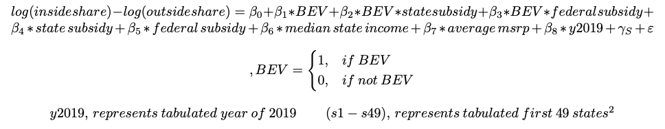
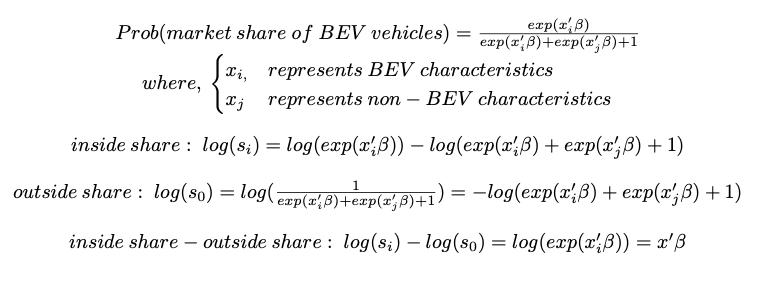
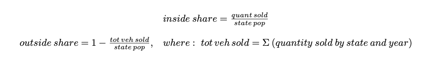
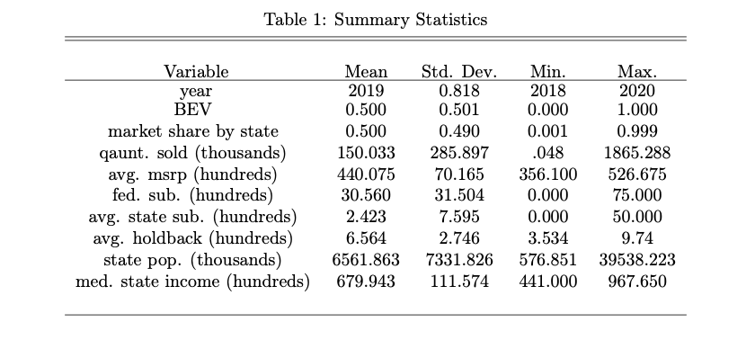
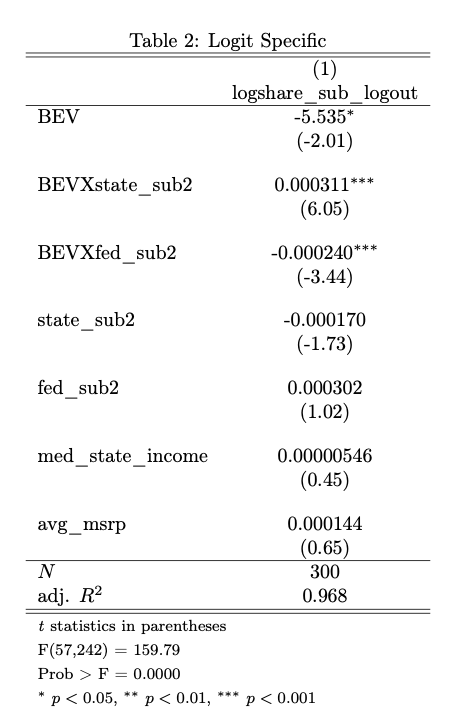
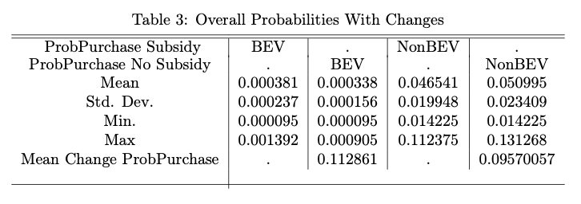
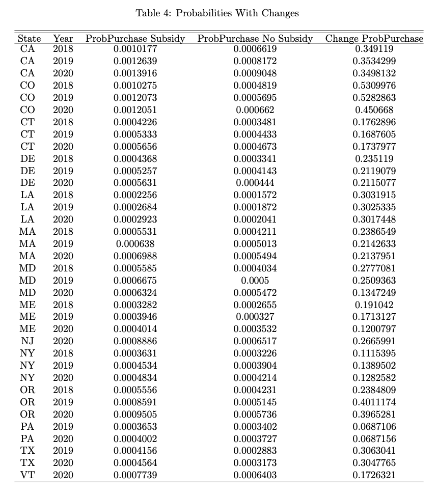

# 
  __U.S CONSUMER PREFERENCE AND POLICY IN BEV 2018-2020__ 

### Nicole R. Rouleau
#### Washington State University May 2022
Battery electric vehicles have gained market growth in the United States due to government policies and consumer preferences. 
Government policy can be an incentive to consumers purchasing electric vehicles, but if consumer preference was strong enough would these incentives still be required? 
In the retail market, consumer preferences have shown to be strong enough to not require incentives in "green" products. 
The consumer preferences for “green” retail products could imply that the automotive market may work similarly and that incentives may not be necessary for the purchase of electric vehicles. 
However, the automotive market has higher costs that may dissuade consumers and require incentives for decision making.  

## Model
### Hypotheses
Consumers and Policy
Consumers are incentivized by state subsidies to purchase battery electric vehicles [1]. Purchase rebates, income tax tax credits, and tax reuctions help combat the overall cost of the vehicle and increase consumer preference for a BEV [2].

<em>H1: State sudbsidies will impact market share of BEVs<em>
  

If incentives at the state level were taken away, consumer preference would still be strong enough for BEV market share to go unchanged. This assumption is based on the interest in "green" retail products that have an increase in cost to the customer and no government incentive, yet has increased in market share [3]. 

<em>H2: Probability of purchasing BEVs when state subsidies are applied will be equal to the probability of purchasing BEVs when state subsidies are not applied<em>
   
  
### Estimating Equation

  

  
A multinomial model was chosen as it does not assume normality, linearity or homoscedasticity; instead it only assumes independence between the independent and dependent variables [4].  
Use of an outside share is representative of not purchasing BEV or non-BEV vehicles allowing the model to aggregate the vehicles in terms of both price and all other characteristics [5]. A clearer representation of the the left-hand side of the regression above: 
 

  

In this estimating equation:   
   

  

  

 ## Data
The data on quantity of BEVs per state per year was based on 13 different BEVs from 10 different companies totaling 300 data points from 2018-2020 on all 50 states from the Alliance for Automotive Innovation. State subsidies are determined by the policy, some of which are decided by the vehicle msrp and brand [6].  

  

  

## Results
### Discussion
The estimating equation was shown to explain that most of the variation was generated by the independent variable allowing the model to be trusted and signifcance levels to be considered valuable. After running a Breusch-Pagan Cook-Weisberg test on the regression, the data was seen to be homoskedastic, allowing for more reliability in the results of the regression and less concern on the mean error. In Table 2, statistical significance can be seen in the treatment variables, indicating that their log odds of effecting market share can be explained by their coefficients. The *BEV* negative coefficient implies that if a vehicle is a BEV it would cause a decrease in market share. The *BEVXfedsub2* negative coefficient is explained by the federal subsidies decreasing every year due to Tesla and GM reaching their maximum funding from 200,000 units sold [7]. The *BEVXstatesub2* positive coefficient increases market share for BEVs. This implies that hypothesis *H1* was correct and will not be rejected, in that state subsidies to impact market share of BEVs.  

  

  
Using coefficient estimates from Table 2 and the left hand side of the estimating equation, the probability of: BEV market share, non-BEV market share and outside share can be found. 
The probability of market share in BEVs and non-BEVs can be seen in Table 3.
Table 4 displays that the only states with any differences between market shares with subsidies and without, were those that established state subsidies in those years. This further proves that the hypothesis *H2* must be rejected. The elasticity of state subsidy in relation to the probability of purchasing BEVs, elasticity is equal to 0.0701, indicating an inelastic relationship. This indicates that a 10% state subsidy increase corresponds with a 0.7% increase in the probability of purchasing a BEV.

  

  

  

  
### Implications
State subsidies have an impact on market share of BEVs, proving that policy does make a difference on how consumers purchase in the automotive market. There has been a proposal to raise the current maximum federal subsidy from $7500 to $12500 and include more limitations in order to encourage more employment and manufacturing within the United States, this has not yet passed [8]. If this does pass, it may increase demand and therefore increase market share of BEVs.
The probability of purchasing BEVs when state subsidies are applied is not equal to the probability of purchasing BEVs when state subsidies are not applied. The probability of purchasing with subsidies versus without is not noticeably large, the percent change between the two proves otherwise (Table 4), showing that the automotive market does not parallel the "green" retail market.  

### Limitations  
Due to how recent battery electric vehicles are in the automotive industry, there is limited data on the subject. With lack of BEVs in the market, there are a low number of public charging points in both rural and low interest areas of the United States [9]; this contributes to the decrease of consumer preference and the purchase of a non-BEV. The newness of the BEV market and lack of education around battery electric vehicles has many consumers left not understanding concepts of battery lifetime and range, unlike gasoline vehicles which have been around for decades. 

## Conclusion
- State subsidies do have positive impact on market share of battery electric vehciles (BEVs)
- Probability of market share of BEVs with a state subsidy is not equal to that without a state subsidy
- The automotive market is slow moving and high cost for consumers causing it to require incentives for BEVs to increase market share  

## References
<a id="1">[1]</a> 
Breetz, H. L., & Salon, D. (2018). Do Electric Vehicles Need Subsidies? Ownership Costs for Conventional Hybrid, and Electric Vehicles in 14 U.S. Cities. Energy Policy. 120, 238-249. https://doi.org/10.1016/j.enpol.2018.05.038
<a id="2">[2]</a> 
Liao, F., Molin, E., & van Wee, B. (2017). Consumer Preferences for Electric Vehicles: A Literature Review. Transport Reviews. 37(3), 252-275. https://doi.org/10.1080/01441647.2016.1230794
<a id="3">[3]</a> 
Kronthal-Sacco, R., & Whelan, T. (2021). Sustainable Market Share Index. NYU Stern. Center for Sustainable Business. https://www.stern.nyu.edu/sites/default/files/assets/documents/Final% 202021%20CSB%20Practice%20Forum-%207.14.21.pdf 
<a id="4">[4]</a> 
Starkweather, J., & Moske, A. K. (2011). Multinomial Logistic Regression. University of North Texas. University of Information Technology.
<a id="5">[5]</a> 
Berry, S., Levinsohn, J., & Pakes, A. (1995). Automobile Prices in Market Equilibrium. Econometrica. 63(4), 841–90. https://doi.org/10.2307/2171802
<a id="6">[6]</a> 
Electric Vehicle Rebates. Efficiency Maine. https://www.efficiencymaine.com/electric-vehicle-rebates/
<a id="7">[7]</a> 
Federal Laws and Incentives. Alternative Fuels Data Center. U.S. Department of Energy: Energy Efficiency & Renewable Energy. https://afdc.energy.gov/laws/all?state=US
<a id="8">[8]</a> 
Shepardson, D. (2021, May 27). U.S. Senate Panel Advances EV Tax Credit of up to $12,500. Reuters. Thomson Reuters. https://www.reuters.com/world/us/us-senate-panel-advances-ev-tax-credit-up- 12500-2021-05-27/
<a id="8">[9]</a> 
Bui, A., Slowik, P., & Lutsey, N. (2021, September). Evaluating Electric Vehicle Market Growth across U.S. Cities. International Council on Clean Transportation. https://theicct.org/sites/default/files/publications/ev-us-market-growth-cities-sept21_0.pdf
